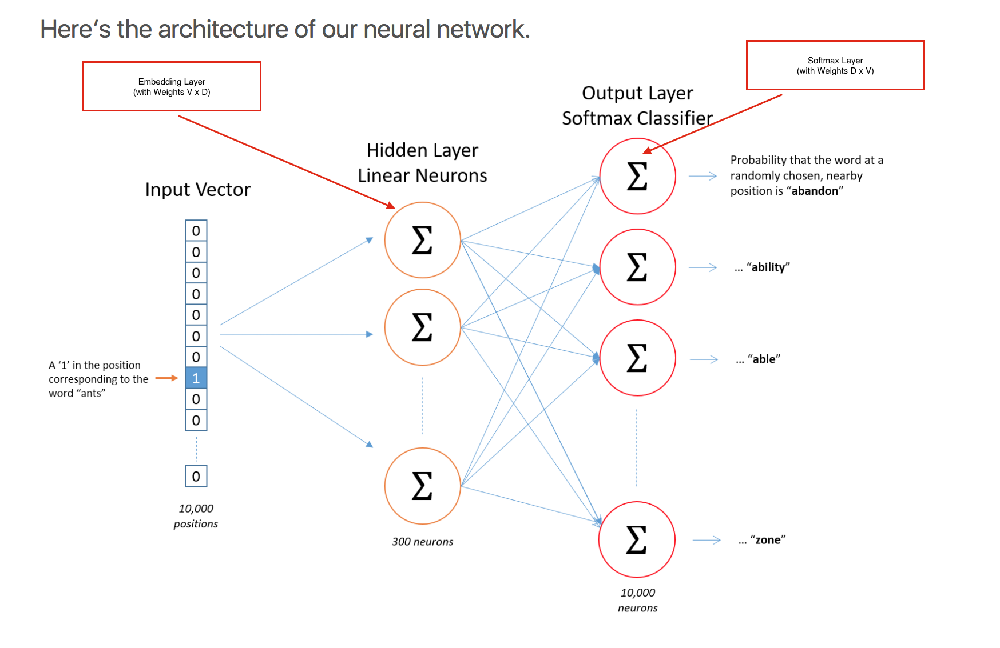
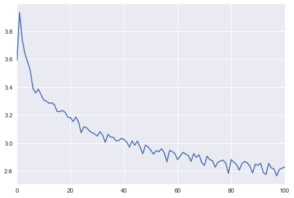
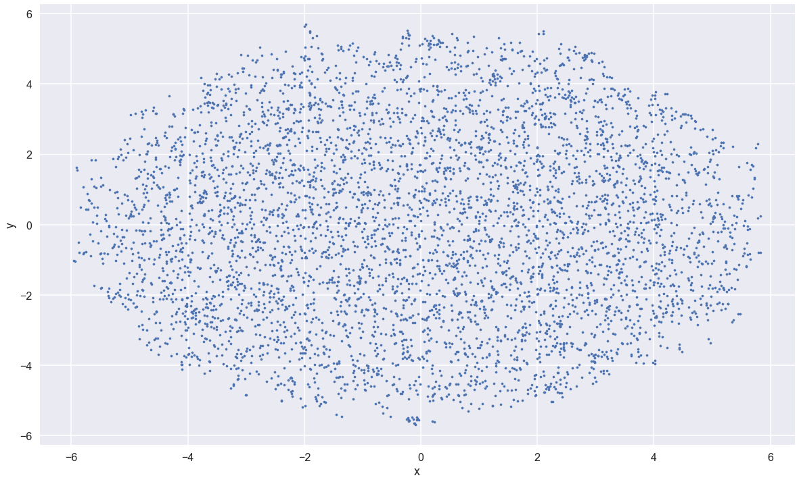
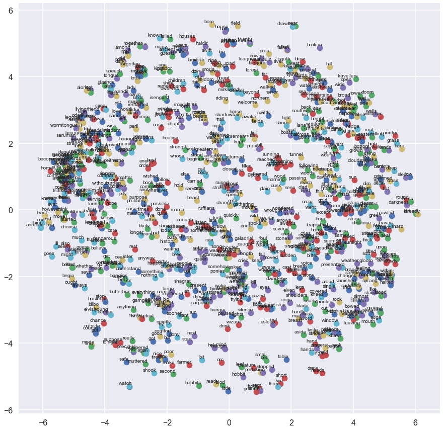

# Word2Vec Skip gram approach using TensorFlow. 


Previously, I have written about applications of Deep learning to problems related to [Vision](https://kapilddatascience.wordpress.com/tag/vision/). In this post, I would like to take a segway and write about applications of Deep learning on Text data. 

To me, [Deep Learning](https://kapilddatascience.wordpress.com/tag/deep-learning/) started with [Word2Vec](https://www.tensorflow.org/tutorials/word2vec). But, if you read the [original paper](http://papers.nips.cc/paper/5021-distributed-representations-of-words-and-phrases-and-their-compositionality.pdf), you will note that the author used DistBelief architecture instead of TensowFlow to come up with their results. 

### Textual data + Bag of Words:
When using Bag of words approach in Text, one comes up with two main problems with Text data:

- `Sparsity`: In text domain, some words occurs only few times in our data set. This makes its extremely hard to learn weights for these rare words.
- `Similarity`: Some words conceptually means the same but BOW approachs gives no notion of how similar are these words. E.x. Kitten and Kitty might mean same and can be used interchangeably. But,using BOW we get learn different weights for these similar words. Given the sparsity of data, we can't share weights for new words, which have similar meaning for prebious words.


### Word2Vec:
This is when the authors of Word2Vec came up with this approach to solve the above problem. 

### Idea:
The idea behind Word2Vec is pretty simple. Words which have similar contexts, tends to have similar meaning. This simple idea lead to a very powerful way of learning text weight vectors. 

### Types of Word2Vec
Word2Vec can be implemented in two ways:-
 
- Skip gram 
- Continous Bag of Words (CBOW)

In this post, I will only talk about Skip gram implementation. Skipgram is easy to understand and implement. 

You can follow the code for this post in this Ipython notebook here [Word2Vec LOTR skip_gram](./Word2Vec_LOTR_skip_gram.ipynb).  

### Unsupervised learning + DataSet used:
Word2Vec is an unsupervised learning problem. That means you don't need any labbeled data. You can work with any set of textual data. 
For this post, I decided to use the chapters from my favorite movie (and, book) `Lord of the Rings`. It's composed of three books and you can find the text [here](http://ae-lib.org.ua/texts-c/tolkien__the_lord_of_the_rings_1__en.htm) or get a copy from my repo [here](./lotr/).


## Skip Gram

- Using Word2Vec we want to learn for a given word, the likelyhood of a word as its neighbor. 
In case your dataset has V unique words (say 200,000), Word2Vec helps us compute for a given word what is the probablity of all other words occuring next to the given words. 
- So, for a word `Barack`, its tries to find what the probablity of other words next to each other. For this case, you guessed right `Obama` word will have the maximum probablity of occurence. Similary, for word `Michelle`, `Obama` word will have the maximum probablity of occurence next to it. In addition to `Obama`, there will be other words which will have similar probability of occurence. 
- So, you will have both words `Barack` and `Michelle`, showing similar word representation. Thus their similarity will be very high. 
- In a nut shell, Word2Vec will help us learn words which may behave similarly. That too, without any training data.

### But How? 
You might wonder but how does Word2Vec learns this behavior.
Lets say your input data set has the line, "The quick brown fox jumps over the lazy dog".

- Word2Vec will convert this unlabbeled data set into a labelled dataset. 
- In SkipGram, we define a window size. This tells how many words left and right of the middle token we can look.
- For window size = 2 and center word, `brown`, we can consider words `quick`, `The `,  `fox`,  `jumps`.
- Thus, one gets a labelled data. For word `brown`, one expects words `quick`, `The `,  `fox`,  `jumps` as its neighbor. These becomes our label or target value. 
- [input, target] = [`brown`:`quick`], [`brown`:`The`],  [`brown`:`fox`], [`brown`:`jumps`] 
- Using a `softmax classifier`, one can learn the probablity of each word given an input word. Here there are `V` possible inputs, and `V` possible outputs. 


### Model Architecture:

Word2Vec Skip-gram approach is implemented using a Neural Network.
Some basic parameters for this task are:

```
window_size: Number of words to look left and right of given word.
V: Vocabulary size (learn from the size of unique words in your dataset)
D: Dimensions of the embeddings
B: Batch size, number of examples to consider at once. 
num_samples: For sample softmax, number of classes to consider 
```

In short, Word2Vec architecture is a 2 layered network.
 
- The input word is represented as 1-Hot encoding layer.
- First layer of the network is the embedding layer. This just acts as a look-up table for the given word and maps the input word to a hidden layer of embeddings. The weights for this layer is `V x D`. For each word, an embedding of size `D`.
- Second layer is the softmax layer which maps the first hidden layer to number of words in Vocab `V`. The weights of this layer is again `V x D`, where D is the fully connected layer from previous layer, and `V` is the softmax layer's output of size `V`.


Pic. taken [from ](http://mccormickml.com/2016/04/19/word2vec-tutorial-the-skip-gram-model/)

- The last layer is just predicting the probability of a word occuring next to the input word.


### Code snippet
- First step is to read the data from the files and perform some tokenization and stop word removal. I used NLTK for tokenization and stopword removal.

```

from nltk.corpus import stopwords
stopwords_set = set(stopwords.words('english'))

tokenizer = nltk.data.load('tokenizers/punkt/english.pickle')
raw_sentences = tokenizer.tokenize(corpus_raw)


```

- Next step is to convert Word tokens into integer representation. And, we find out the vocabulary size of the data set `V`

```
def build_dataset(words):
  count = [['UNK', -1]]
  count.extend(collections.Counter(words).most_common(vocabulary_size - 1))
  dictionary = dict()
  # adds index to the word sorted by word count.
  for word, _ in count:
    dictionary[word] = len(dictionary)
  data = list()
```

- Then we generate our label data set using batches. This function takes `batch_size`, `num_skips`, `skip_window` as inputs. For a sample data we get the following output.

```
data: ['john', 'ronald', 'reuel', 'tolkien', 'lord', 'rings', 'fellowship', 'ring', '1954']

with num_skips = 2 and skip_window = 2:
    batch: ['reuel', 'reuel', 'tolkien', 'tolkien', 'lord', 'lord', 'rings', 'rings']
    labels: ['tolkien', 'ronald', 'reuel', 'ronald', 'tolkien', 'rings', 'fellowship', 'tolkien']

with num_skips = 4 and skip_window = 4:
    batch: ['lord', 'lord', 'lord', 'lord', 'rings', 'rings', 'rings', 'rings', 'fellowship', 'fellowship', 'fellowship', 'fellowship', 'ring', 'ring', 'ring', 'ring']
    labels: ['reuel', '1954', 'rings', 'john', 'tolkien', '1954', 'j', 'ronald', 'reuel', '1954', 'tolkien', 'rings', 'j', 'fellowship', 'r', 'r']
```
- `Tensor Flow graph`: Next step is to define the tensor flow graph with loss parameter. In this we define, the input training data set `train_dataset`, ist output neighbors as labels `train_labels`. Hidden embedding layer `embeddings` as weights, `softmax_weights` as weights and `loss` as the loss to minimize. 

```
  train_dataset = tf.placeholder(tf.int32, shape=[batch_size])
  train_labels = tf.placeholder(tf.int32, shape=[batch_size, 1])
  valid_dataset = tf.constant(valid_examples, dtype=tf.int32)
  
  # Variables.
  embeddings = tf.Variable(
    tf.random_uniform([vocabulary_size, embedding_size], -1.0, 1.0))
  softmax_weights = tf.Variable(
    tf.truncated_normal([vocabulary_size, embedding_size],
                         stddev=1.0 / math.sqrt(embedding_size)))
  softmax_biases = tf.Variable(tf.zeros([vocabulary_size]))
  
  # Model.
  # Look up embeddings for inputs.
  embed = tf.nn.embedding_lookup(embeddings, train_dataset)
  # Compute the softmax loss, using a sample of the negative labels each time.
  loss = tf.reduce_mean(
    tf.nn.sampled_softmax_loss(softmax_weights, softmax_biases, embed,
                               train_labels, num_sampled, vocabulary_size))

  # Optimizer.
  optimizer = tf.train.AdagradOptimizer(1.0).minimize(loss)
  
```
- `Loss`: The loss function used here is not the one we usually use for classification. We use `tf.nn.sampled_softmax_loss` as we don't want to find the softmax for all other classes. The trick is that we only calculate the loss for only a sample set of negative classes. This approximates the loss and speed's up some of the training time.

- `Similarity`: We compute the cosine similarity between our validation data set(most frequently occuring words) with our embeddings learnt. 
- `Run the graph`: Finally, we run the tensor flow graph in a session by fedding the input variables in `feed_dict`

```
 for step in range(num_steps):
    batch_data, batch_labels = generate_batch(batch_size, num_skips, skip_window)
    feed_dict = {train_dataset : batch_data, train_labels : batch_labels}
    _, l = session.run([optimizer, loss], feed_dict=feed_dict)
    average_loss += l
    if step % 2000 == 0:
      if step > 0:
        average_loss = average_loss / 2000
      # The average loss is an estimate of the loss over the last 2000 batches.
      print('Average loss at step %d: %f' % (step, average_loss))
      loss_history.append(average_loss)  
      average_loss = 0
    # note that this is expensive (~20% slowdown if computed every 500 steps)
    if step % 15000 == 0:
      sim = similarity.eval()
      for i in range(valid_size):
```

### Results:
- After 200000, we observe that the loss is decreasing. 
- I also print out the most similar words to the random occuring frequent words. 



```
Average loss at step 194000: 2.766296
Nearest to dark: trees, deep, light, shirelike, twined, winking, dense, slowly,
Nearest to eyes: sun, face, strangling, looked, disgust, brows, bloodshot, bright,
Nearest to road: way, south, far, bridge, path, brandywine, behind, hills,
Nearest to say: ninnyhammer, even, grand, said, breed, halfast, popularly, live,
Nearest to saw: stood, looked, see, behind, appeared, came, looking, climbed,
Nearest to come: going, shouting, comes, doughtiest, dillo, wheedling, mess, good,
Nearest to pippin: merry, frodo, sam, gamgee, gandalf, back, flotsam, reply,
Nearest to shall: offensive, get, secondly, must, holiday, fault, see, planning,
Nearest to like: wonder, came, see, old, went, behind, nguruthos, air,
Nearest to UNK: much, cur, undergate, everywhere, maggots, grass, indeed, ballast,
Nearest to merry: pippin, said, sam, frodo, obviously, blanched, producing, ironmongery,
Nearest to sam: frodo, much, merry, pippin, gandalf, last, refilled, said,
Nearest to upon: smashed, foods, basins, clumsier, flickers, white, strewn, furled,
```
- - You can see for `sam `:  `Frodo`, `merry ` , `pippin`, `gandalf` are close to each other. Similarly for `Pippin` and `Merry`


## t-SNE:
- So, far we were able to find `300` dimensional vector for each word. However, we can't plot these words on 2-D space. 
- One way to plot high dimensional data to 2-D space is to run [t-SNE](https://en.wikipedia.org/wiki/T-distributed_stochastic_neighbor_embedding) on it. 
- `t-SNE` is different from `PCA`, although latter is also an dimensionality reduction technique. 

### t-SNE code:
t-SNE is already implemented in python. We pass our learned embeddings to the t-SNE code. And, ask to return only 2 dimensions, since our goal is to plot it.

```
tsne = TSNE(perplexity=30, n_components=2, init='pca', n_iter=10000, n_iter_without_progress=30, verbose=1)
two_d_embeddings = tsne.fit_transform(final_embeddings[1:num_points+1, :])
print ("tSNE done...")
```


### Plot:
It's hard to interpret but one can plot the following graph.




### Similar words:
I wanted to see what are the most similar words to some of the words I love from the movies:

```
Nearest to frodo: sam, gollum, mr, faramir, rankle, helps, ssss, revolts,
Nearest to sam: frodo, gollum, master, right, hobbit, conical, voice, hand,
Nearest to gandalf: merry, aragorn, wormtongue, pippin, well, flash, saruman, king,
Nearest to rings: counter, smoked, ronald, silver, tolkien, purchased, masster, rashers,
Nearest to shire: bree, mined, instance, pickers, collapse, days, unthanked, serene,
Nearest to lord: denethor, golasgil, said, warden, say, abed, service, chieftain,
Nearest to dark: mirkwood, light, fought, greater, hesitatingly, even, casks, instructing,
Nearest to enemy: neighbours, test, deliver, contrive, ring, hope, grudgingly, striven,
Nearest to merry: pippin, flotsam, gandalf, treebeard, blanched, aragorn, ironmongery, speechless,
Nearest to uncle: fashioned, harfoots, k, suggests, flagstone, quote, swag, fondly,
Nearest to pippin: merry, gandalf, differ, aragorn, flotsam, gilded, beregond, steward,
Nearest to elves: folk, mischances, sorrows, days, men, noiseless, herubrand, among,
Nearest to hobbits: veritable, climb, nice, solitude, ssss, hitch, habits, stammering,
Nearest to feet: foot, standards, thong, leaden, legs, greenfooted, menel, two,
Nearest to treebeard: ent, hm, merry, inches, indignant, hoom, ents, finery,
Nearest to trees: birch, kel, trumpeting, rustled, bushes, oval, shapes, oaks,
Nearest to man: denethor, men, wilfully, threatened, vanwa, old, tuck, daughter,
Nearest to rohan: rohirrim, performance, serried, allotted, tidings, rides, westfold, army,
Nearest to gimli: legolas, aragorn, brightened, foodless, gl, omer, brethren, fangorn,
Nearest to axe: dwarf, aragorn, staves, fangorn, sword, hand, mail, apart,
Nearest to orcs: wellnigh, ling, hold, followers, misleading, elements, omer, gangways,
Nearest to bow: arrow, bows, forthcoming, host, gifts, stages, quests, stouter,
Nearest to war: rohirrim, swag, maintained, galenas, sailed, policies, stead, king,
Nearest to army: osgiliath, obedience, cleverness, vi, numbered, thrones, raids, rohan,
Nearest to precious: agol, gets, nicely, sm, pretty, hornblowers, thieves, greys,
```

### Thank You:
- I would like to thank Udacity [Deep learning course](https://github.com/tensorflow/tensorflow/blob/master/tensorflow/examples/udacity/5_word2vec.ipynb) for better understanding of the concept. 
- And, Siraj Rawal's original post on [Word2Vec on Game of thrones](https://github.com/llSourcell/word_vectors_game_of_thrones-LIVE) for the inspiration of running Word2Vec on `LOTR`

## Code:
- Code for this blog can be found here [Word2Vec_LOTR_skip_gram.ipynb](https://github.com/kapild/blog_sample/tree/master/ml/deeplearning/word2vec/Word2Vec_LOTR_skip_gram.ipynb)
# References: 

- [demystifying-word2vec](http://www.deeplearningweekly.com/blog/demystifying-word2vec)
- [Word2VecAndTsne](https://github.com/jeffThompson/Word2VecAndTsne)
- [part-3-more-fun](https://www.kaggle.com/c/word2vec-nlp-tutorial/details/part-3-more-fun-with-word-vectors)
- [word2vec](http://hduongtrong.github.io/2015/11/20/word2vec/)
- [Tensor flow word2vec](https://www.tensorflow.org/tutorials/word2vec)
- [mccormickml.com  Word2Vec Skip gram](http://mccormickml.com/2016/04/19/word2vec-tutorial-the-skip-gram-model)
- [www.thushv.com  Word2Vec Skip gram](http://www.thushv.com/natural_language_processing/word2vec-part-1-nlp-with-deep-learning-with-tensorflow-skip-gram/)


